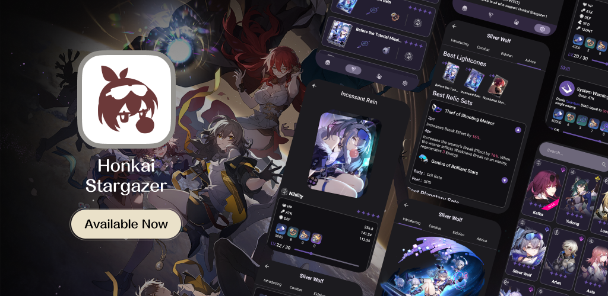
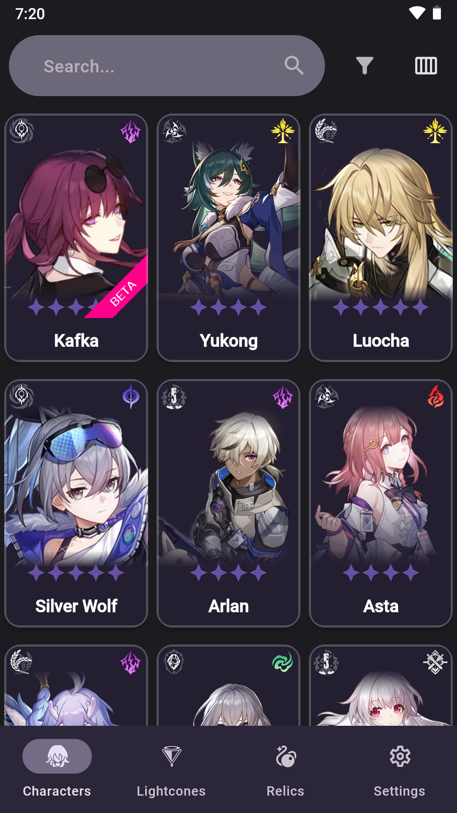
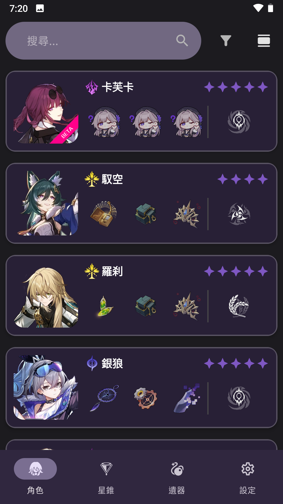
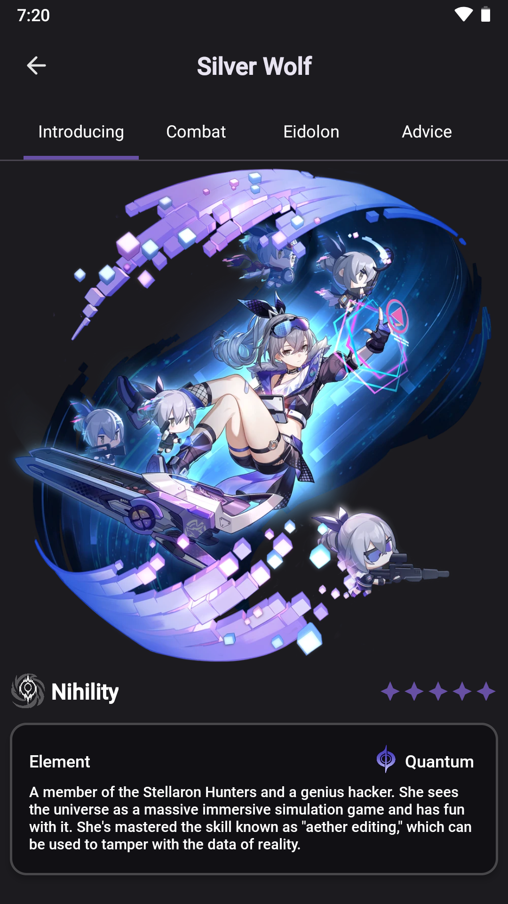
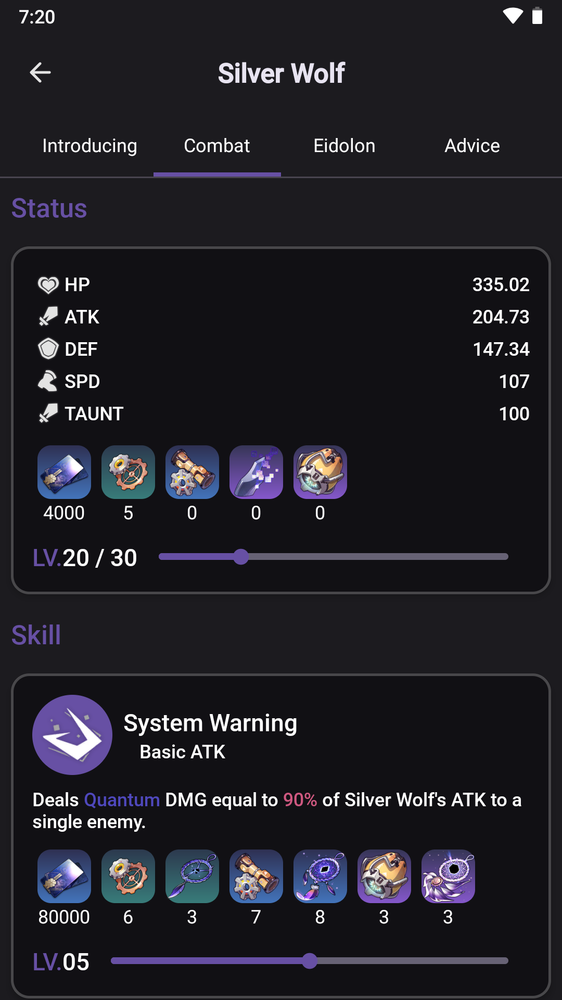
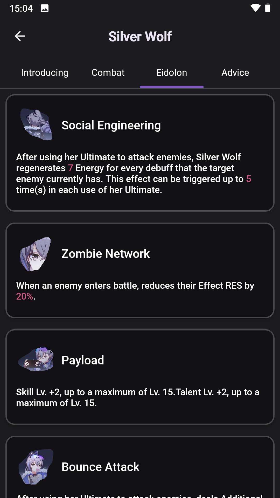
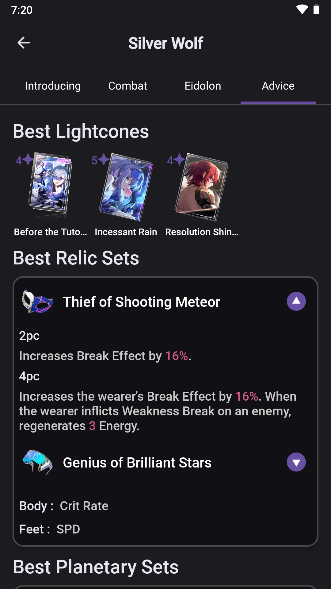
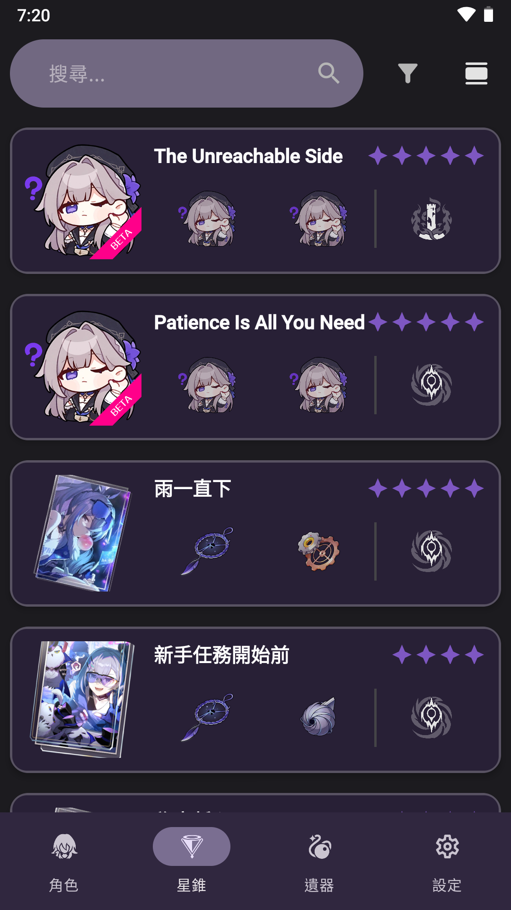
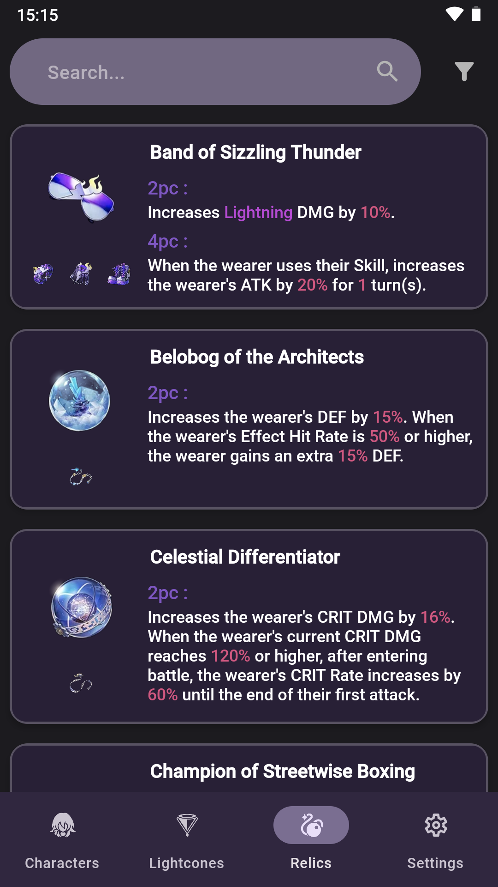

# Honkai Stargazer
> A project that included characters, lightcones, relics and more information. Hope to give a help to all of us on journey in *Honkai : Star Rail*<br>
```
We are trying to develop it to simplify workflow and improve user experience
```

[](https://opensource.org/licenses/Apache-2.0)


### Project Organizor 


### Idea Suggester & UI Designer 
#### SipTik (siptik)

### Icon Designer 
#### 2O48 (2o48)

### Join our Offical Discord Server Now ~
[](https://discord.gg/uXatcbWKv2)

### Get Honkai Stargazer in Google Play
<a href='https://play.google.com/store/apps/details?id=com.voc.honkai_stargazer_gp&pli=1&pcampaignid=pcampaignidMKT-Other-global-all-co-prtnr-py-PartBadge-Mar2515-1'></a>


### Crowdin Translation Progress
].data.translationProgress&url=https%3A%2F%2Fbadges.awesome-crowdin.com%2Fstats-15282854-591669.json)
].data.translationProgress&url=https%3A%2F%2Fbadges.awesome-crowdin.com%2Fstats-15282854-591669.json)
].data.translationProgress&url=https%3A%2F%2Fbadges.awesome-crowdin.com%2Fstats-15282854-591669.json)
].data.translationProgress&url=https%3A%2F%2Fbadges.awesome-crowdin.com%2Fstats-15282854-591669.json)
].data.translationProgress&url=https%3A%2F%2Fbadges.awesome-crowdin.com%2Fstats-15282854-591669.json)
].data.translationProgress&url=https%3A%2F%2Fbadges.awesome-crowdin.com%2Fstats-15282854-591669.json)
].data.translationProgress&url=https%3A%2F%2Fbadges.awesome-crowdin.com%2Fstats-15282854-591669.json)

## We need you !
### Translator 
- If you want to help us on translating, feel free to join us through <a href="https://crowdin.com/project/genshin-spirit/invite?h=a5b551bd4396ec965a65c8a9a29260401802677">Crowdin</a> ~
- If you want to translate new language, you may directly DM Voc-夜芷冰 (vocaloid2048)

### Developer
- If you are interested on helping us on developing Honkai Stargazer (Android / Cross-Platform Version)
- Or developing other external products (E.g. Honkai Stargazer Rainmeter Skin by `vocaloid2048`)
- Feel free to DM Voc-夜芷冰 (vocaloid2048) ~
- P.S. Android Version base on Java+XML, Cross-Platform Version still haven't any plan of it

### Beta Testers
- If you want to help us on improving user experience and debug
- Or want to try the beta version of Genshin Spirit
- Feel free to contact Voc-夜芷冰 (vocaloid2048)

## Device Suggestion
|                 | Minium                | Awesome                |
|-----------------|-----------------------|------------------------|
| Android Version | 8.0 (API 26) or above | 10.0 (API 29) or above |
| RAM             | 2GB                   | 4GB or above           |
| Storage         | 150MB                 | 1GB or above           |
| App Version     | Hmm…                  | Latest !               |

## Feature
<table>
    <tr>
        <td>
            
        </td>
        <td>
            
        </td>
        <td>
            
        </td>
        <td>
            
        </td>
    </tr>
    <tr>
        <td>
            
        </td>
        <td>
            
        </td>
        <td>
            
        </td>
        <td>
            
        </td>
    </tr>
</table>

1. [Home Page](#home-page)
    - [Available Soon](#available-soon)
2. [Character/Lightcone/Relic List](#characterlightconerelic-list)
3. [Character Page](#character-page)
4. [Lightcone Page](#lightcone-page)
4. [Setting Page](#setting-page)
    - [Appearance](#appearance)
    - [About](#about)
    - [Special Thanks](#special-thanks)
    - [Credit By](#credit-by)
    - [Donate](#donate)

## Home Page
### Available Soon 

## Character/Lightcone/Relic List
User can select character(s) they would like to search in this list, which also contains :
- Search By Text (**Both English and language you selected in app are available**)
- Search By Element/Rarity/Path/Status
    - Simply select requirement(s) of who you want to search
    - Press *Apply* and the list will show the result to you
- Different layout of list item   
    - Two types of layout

## Character Page
User can read character's information inside this scrollable page
- Scrollable SeekBar for user to know each level's materials count that required
- Colored Text for user to read the important value and Element easily
- Character Eidolon is also available !
- Character Advice Page can give user a nice idea of their characters
#### # P.S. Advice Page will be unselectable if there don't have data of it. (./app/src/main/assets/character_data/advice)

## Lightcone Page
User can read lightcone's information inside this scrollable page
- Scrollable SeekBar for user to know each level's materials count that required
- Colored Text for user to read the important value and Element easily
- ~~High-Resolution Image shown at the top of the page~~

## Setting Page
### Appearance 
User can customize their own preferences in this app :
- Language (See [Crowdin Translation Progress](#crowdin-translation-progress))
- Material Color
- Theme (DayNight)
- Haptic Feedback
- HSR Font
- Shadow of List Item

### About
User can view `Version Code` of Compiled App, also with our contact way.

### Special Thanks
**Really, Really Thank You for those who helped us to improve this project! (By Vocchi)**

### Credit By
Here's the links of some data in this project we reference from. Thanks also.

### Donate
In this project, we had included the donation function (Google Play)<br>
Please feel free to donate as you wish. Vocchi will be thankful for your kindly donation

```
P.S. Vocchi don't drink coffee actually.
```


## Disclaim
*This application is not affiliated with miHoYo Co. Ltd. 崩壞•星穹觀星者(Honkai Stargazer) is only an app that provides data developed by fans. The information provided in this app is for reference only. Honkai Stargazer will not guarantee the accuracy and completeness of any information provided on it to any degree.*

*This application will not collect any personal privacy data that may be used to identify and track users along with other information. If necessary, the application will only collect application stack errors and limited device information[Note 0]. The collected data is used to repair application vulnerabilities and improve user experience.*

*This project (崩壞•星穹觀星者 Honkai Stargazer) does not object to anyone adding functions, debugging, compiling and testing, and using it for learning purposes, but this project does not allow third parties to distribute freely (whether private or public) the unofficial version [Note 1] without written permission from Voc-夜芷冰, and deliberately pretend to be the developer of this project. Voc-夜芷冰 reserves the right to ask individuals/institutions who violate the above conditions to be removed.*

<br>[Note 0] We will only collect : 
- Your device name
- Your device's Android Version
- App Version
- Your Language & DayNight Preference in App

<br>[Note 1] The unofficial version includes third-party self-compilation and distribution after downloading the application installation file on the cooperative platform.
