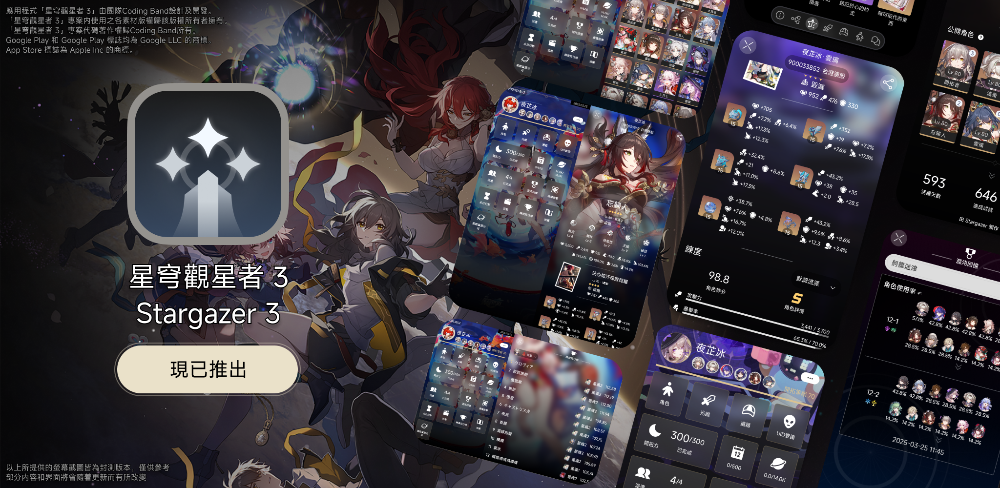

# 星穹觀星者 3

> *「開拓」之旅永不結束，他只是到了他的下一站* 
> 我們期望能透過重寫星穹觀星者，讓用戶體驗、營運優化、維護等方面更上一層樓 
> 亦希望延續開拓的精神，讓「星穹觀星者」繼續為各位開拓者提供更多幫助！

 + 

星穹觀星者 3 是由團隊[Coding Band](https://github.com/Coding-Band)開發
- [2O48](https://github.com/2O48) : UI/UX 設計
- [夜芷冰](https://github.com/Vocaloid2048) : Team Leader 兼全棧代碼編寫 (Head-to-Tail)
- [Somebody](https://github.com/ilikecatgirls) : 部分後端API代碼編寫

將於 Google Play Store 和 App Store 上架，讓使用 Android, iOS & MacOS 的開拓者都能夠體驗星穹觀星者 3。
未來也會透過GitHub分發其他平台的版本。

| 📢 如果不介意的話，可以透過Buy Me A Coffee支持我們  |  |
|-----------------------------------------------------------------------|------------------------------------------------------------------------------------------------------------------------------------------------------------------------------------------------------------------------------------------------------------|
| 📧 歡迎聯絡我們合作              |                                                                                                                         |

### Crowdin 翻譯進度

## 有別於第二代：
- 支援Windows & MacOS了！
- 對平板、電腦使用體驗作出優化
- 輕量化App，減少下載大小
- 一堆介面上的修正（設計師的要求）
- 使用 *Compose Multiplatform* 編寫
- 等等...

## App 功能
### 主要分為以下類別：
  - 角色、光錐、遺器資料查閱
  - 用戶當前數據、擁有角色詳情
  - 角色/隊伍使用率排行榜
  - 練度排行榜
### 未來的功能
  - 排軸（1.1 版本）
  - 躍遷分析（投票）
  - 躍遷模擬（投票）
  - 通知功能（考慮中）
  - 還有其他想法嗎？歡迎與我們分享~

## 手機螢幕截圖 (拍攝於2025/03/25)
| 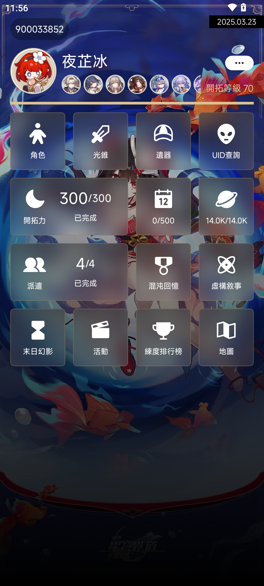 | 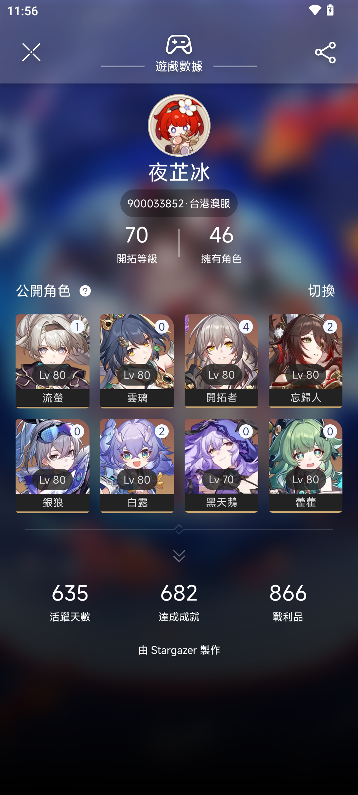 | 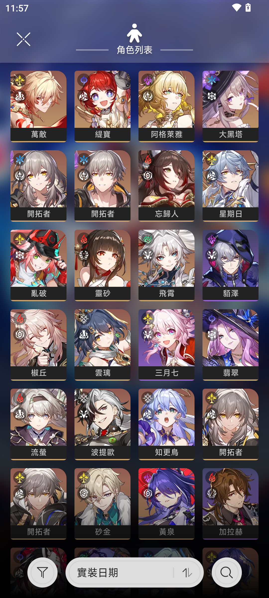 | 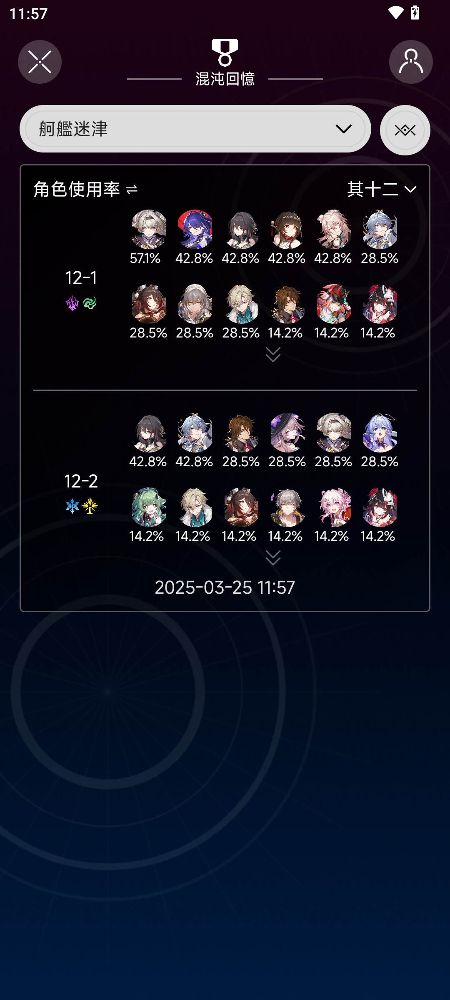 |
|-----------------------------------------|-----------------------------------------|-----------------------------------------|-----------------------------------------|
| 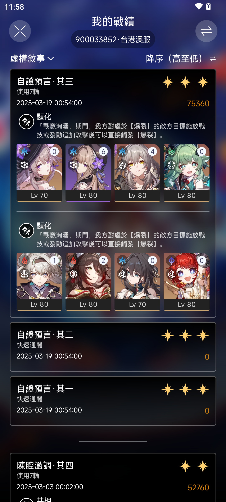 | 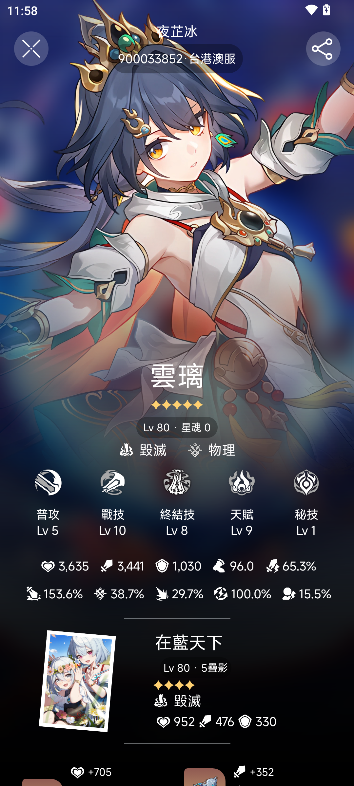 | 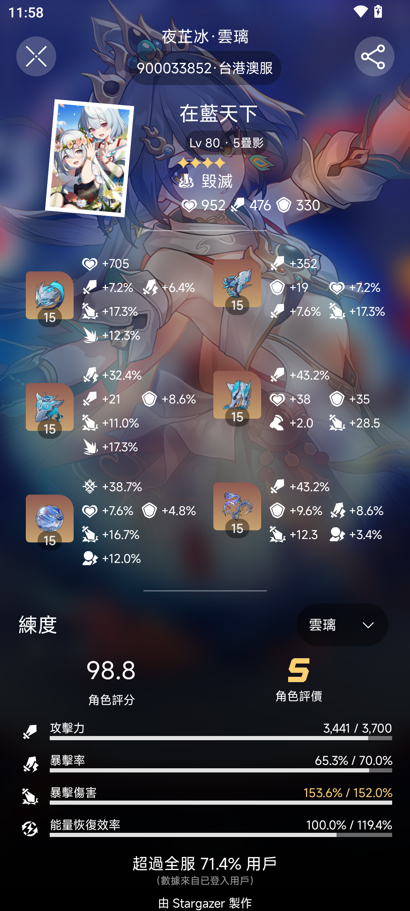 | 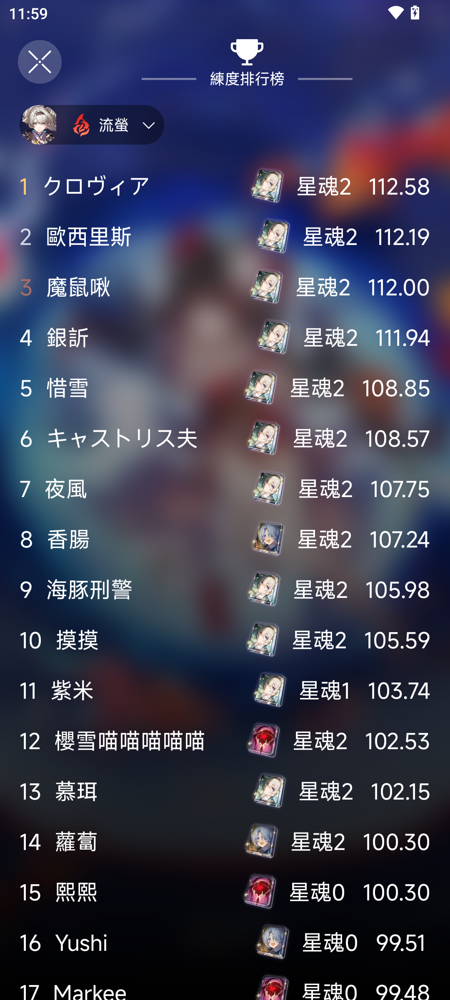 |

## 寬螢幕（Desktop）螢幕截圖 (拍攝於2025/03/25)
| 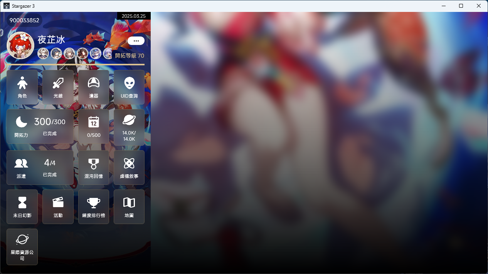 | 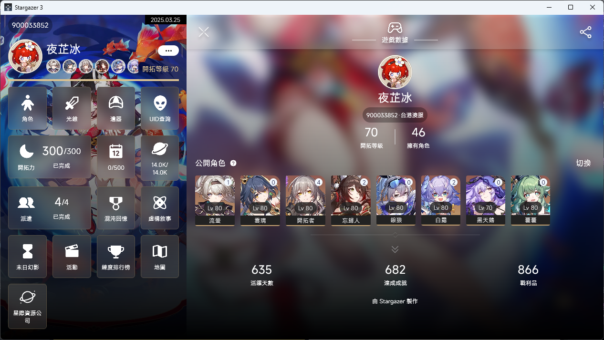 | 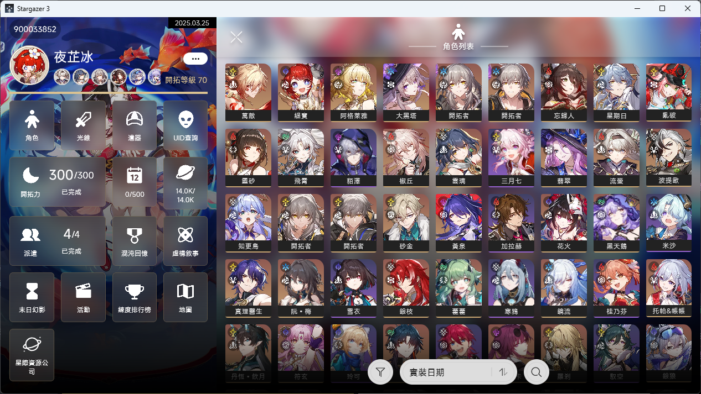 | 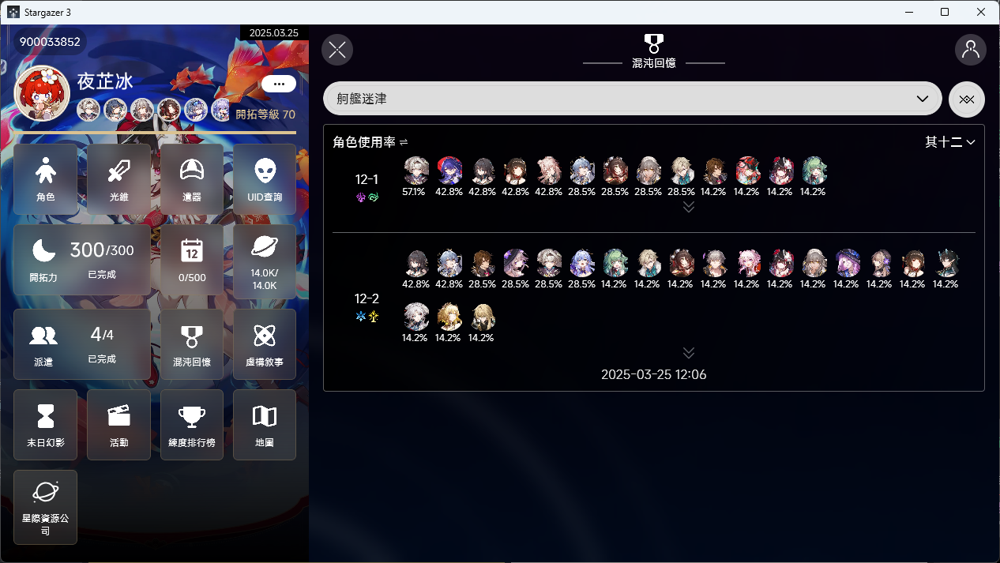 |
|-----------------------------------------|-----------------------------------------|-----------------------------------------|-----------------------------------------|
| 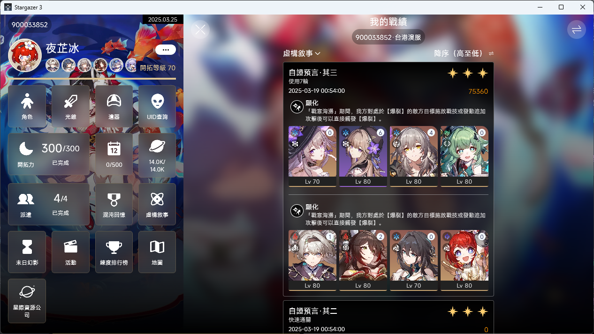 | 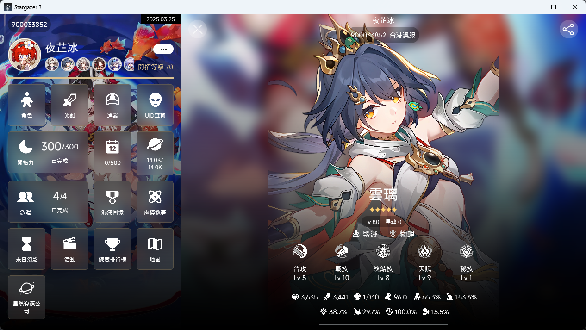 | 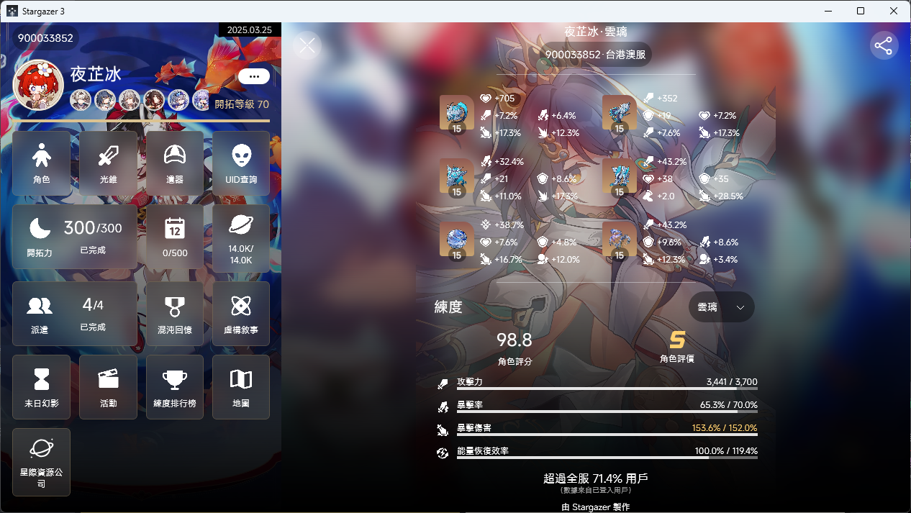 | 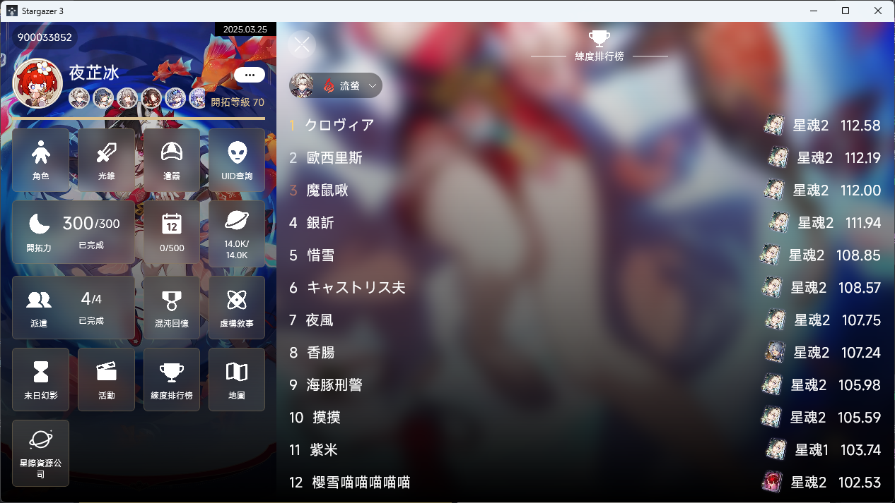 |

## 幫幫我，開拓者

我們目前在招募志願者協助我們提升 App 的質量:

### 翻譯 （把 App 的文字變成朋友都能看懂）
- 語言不限
- 人數不限
- 使用 [Crowdin](https://crowdin.com/project/stargazer-2) 翻譯協作平台

### Beta 測試員 （在功能推出前先幫忙找 Bug）

- 人數：100 人 (Android 和 iOS)
- 需要遵守<守則>
- 違犯規則者將被永久停止測試資格
- 請私信`@yukina4096` 提出申請，並提供以下資料 :
  - 使用的平台(Android / iOS / Windows / MacOS)
  - 接收BETA測試的電郵 (iOS 的話請記得提供有綁定 Apple ID 的電郵)
  - 星穹鐵道 UID （方便我們紀錄錯誤之類，還請測試時用那個 UID 的帳戶登錄）

### <守則>

- 不得公開、私下分發 BETA 版本予任何人
- 不得拆包、捉包、反編譯 、重新打包 App
- BETA 版本並不代表正式版，務必注意
- 不得惡意攻擊伺服器/使伺服器無法正常提供服務
- 請留意，團隊内所有成員均為志願工作，我們不會亦不可能要求視其為員工
- 志願工作並不會有任何報酬，亦不會向其收取任何費用
- 任何違反規則者將被永久停止測試資格

### 關於 Coding Band

Coding Band 由 3 位核心成員組成,分別是 : 

- 《設計大佬》[2O48](https://github.com/2O48)
- 《禮貌貓咪》[夜芷冰](https://github.com/Vocaloid2048)
- 《Furina》[Somebody](https://github.com/ilikecatgirls)
  

# 後日談 - 為何重寫？
(以下內容純屬個人感想，請勿對號入座，笑笑就好）

## 背景：SG2推出時，就已經注定了失敗？
從23年11月底開始開發，到1月的封測，經歷了兩個月 
在24年二月初，我們十分高興地推出了Stargazer 2，也承蒙各位開拓者的支持

可惜的是好景不長，二月中的時候，我和另一位主力的開發者因為在雙方的處理SG2的態度 
以及各種先前的意見不合，所以分道揚鑣 
(細節就不細說了，不希望再引起單方面的不滿) 
在分道揚鑣後，我繼續保留Stargazer的所有權，並繼續完成未完成的To-do list內容

尷尬的是，一個人的效率始終有限，沒法跟以前兩個人的進度比較 
（然後又經常和以前比較，兼且又開學了） 
我也多次跟設計師談及這個問題，亦有想過要不要再邀請別人合作 
想了一段時間，最後還是決定不再邀請別人直接合作（這個項目）

當時的我對SG2使用的React Native框架不太熟悉 
經驗主要靠處理 *二月初沒人處理的bug* & *寫抽卡模擬等功能*累積 
SG2是使用firebase來作後端伺服器 
基本上都是他寫的，我只能通靈自己理解（總不能要求什麼交接吧） 
就這樣從二月中chur到四月... 學業基本上都一般般，能合格就好

## 契機：一切都從去年的四月說起
在去年（24年）四月的時候，我剛剛接觸Jetpack Compose 
想說這東西看起來很酷，能用Material 3（Android UI Theme） 
但沒法用以前那麼視覺化的XML編輯器（主要是不能拖動元件啊！！！） 
不過也可以接受，先拿它來寫一下一些頁面 
而且還是Kotlin誒，基本上我能夠直接當Java來寫OwO 
除了Boolean Expression的 ( XXX ? AAA : BBB ) 要換成 if(XXX) AAA else BBB 
其他都很方便（因為寫的功能簡單嘛）

結果花了一個星期在學校圖書館【玩】這個框架ww 
寫了幾頁，角色/光錐/遺器頁面（對，現在你看到的，頁面有一半是那時寫的） 
不過，五月就是期末考了，不能寫了

## 為何 ：重寫的想法出現了
> 誒 只是過了三個月 這麼快就想重寫是在幹啥啦

是的，它出現了。
基本上重寫的原因如下：[開發者的留言](https://discord.com/channels/880921456903618610/1109685610031104061/1256989636761223248)
- 代碼維護複雜度、使用流暢度、Bug處理程序問題

實際還有：
- 我對React Native (RN) 的認識不足，尤其對hook什麼時候用
- 我因為分道揚鑣而抗拒使用RN，不希望日後突然有所有權的爭執
- SG2內部結構其實有點複雜，需要自行通靈
- Firebase 對於一個大學生來說，後來每月1000+港幣，蠻貴的
- SG2寫的時候，只考慮手機的使用體驗，然後是寫死了佈局（用平板的時候體驗很不友善）
  - 很多東西都是大小Size寫死數值，動一動效果就塌了
- 依賴更新，Expo更新，然後以前還試過依賴的依賴的pom不見了，導致下游所有人都沒法用
  - 每次更新有如大冒險，天知道今次是依賴更新，還是Expo不爽你

## 重寫吧！
在24年七月的時候，我正式開始重寫了（六月偷步寫了點東西，所以7月1日不是真的第一天） 
當時是從Jetpack Compose搬過來Compose Multiplatform 
要說簡單嘛？UI確實簡單 
不過因為那個時候CMP在1.5版本，引入了`composeResources/files`的東西（實驗性） 
而且能參考的blog也不多，內容主要圍繞1.4或以前的內容 
硬是花了一點時間處理（把Resource讀成ByteArray -> Coil讀取，印象中啦，現在已經沒用了)

詳情可以看看 [SG3日記](https://discord.com/channels/880921456903618610/1256994211702509721)
目標也定得很明確了
- 支援寬屏幕
- 簡化維護難度，對開發者友善
- 棄用Firebase，自己架設後端，盡量做到營運不用花太多錢

## 第一次封測
在暑假結束前，硬着頭皮招募&開展了第一次封測 
hmm 效果不太好，主要是因為我高估了自己的進度 
還有當時SG3對iOS的優化，卡到懷疑人生，免費送贈閃退玩法 
然後每次都要打包快200MB的apk（因為所有素材都放在裡面了） 
最後還是在暑假最後無限期暫停了，有計畫聖誕節重啟

## 第二次封測：一個學期過了
一月的時候，放寒假了～ 
該是時候動動SG3了（找點麻煩） 
這個時候SG3也用上了CMP 1.6，後來升級到1.7 
效果不錯了w，在瘋狂被設計師要求UX的內容後 
封測前總算把很多卡頓/Bug修正了 
詳情可以看日記，這邊不細說，太多東西了 
-# 設計師：要不用回RN / 別拿BETA來給別人用 / 你用RN寫肯定沒這麼多效能問題 / 吧啦吧啦

然後就開始籌備第二次封測 
其實也很感謝大家的幫忙，尤其是冰凝 
幫忙超級多，特別是邊際個案的部份（網絡） 
本來想說應該還好，一測下去，看來是Timeout設得太緊，應該合理放寬 
還有其他封測測試人員 `Eo, 社長, 銀訢,初音未來我婆啦)` 
實在感謝您們，真的幫大忙了🙇‍♂️ 🙇‍♂️ 🙇‍♂️ 🙇‍♂️ 🙇‍♂️ 🙇‍♂️ 

最後在三月二十六日，正式發佈！

## 我後悔嗎？
### 當然後悔啊，但一次失去獲得的機遇，還是很值得
一直以來，我都不希望有人走，明明大家都已經合作了這麼久的時間
（每一段關係都很花時間和心力欸）
但後來想開後，就還好了

如果沒有SG2，我大概這輩子不會碰跨平台開發 
如果沒有一人扛兩人，我在2024年不可能學了Typescript, Kotlin, MySQL, C++等等 
如果沒有堅持保留SG2，我不敢想像現在的Stargazer會荒廢成怎樣 
如果沒有獨自營運SG2，我大概也不會認識怎樣和App Store & Play Store App上架，審核，要求等等的東西 
如果沒有這份經驗，我大概是瓩時的人吧（打1000小時的瓦） 
懶得如果了 從零開始的重寫生活，大概就是這樣

## 致過去的我，以及現在的您
作為一位興趣為主的開發者，或者上到大學遊手好閒想玩玩（不是我） 
若果您在思考是否加入CMP的話，我會推薦您先了解一下CMP和Flutter & RN的對比 
（可以參考其他大大的，這邊就不【識少少扮代表】了） 
推薦參考 [Android 工程師大大的巴哈文](https://forum.gamer.com.tw/C.php?bsn=60292&snA=8758) 從專業角度來看待CMP

說回我自己 
我當初選擇CMP的原因，主要是因為Kotlin和Java的相似度（基礎），以及學習曲線 
但初期的坑都不容易填，現在的話有些地方還是一樣，官方還在加把勁中 
（例如iOS返回手勢，框架內附語言更換功能） 
請有心理準備，現在還是要搭配一定量的平台專屬(actual / expect)代碼編寫 
建議搭配具一定能力的AI（我這邊用Copilot做一些大範圍的邏輯構思/建議推薦；Grok寫一些CMP相關的輔助功能） 
最後，玩得開心，不要累壞自己啦，也歡迎留言分享您的難處，大家互相交流～

夜芷冰