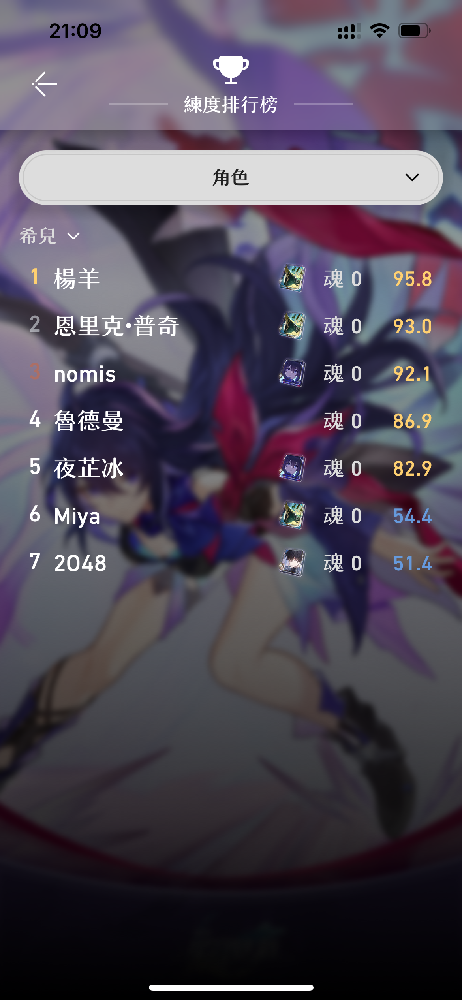
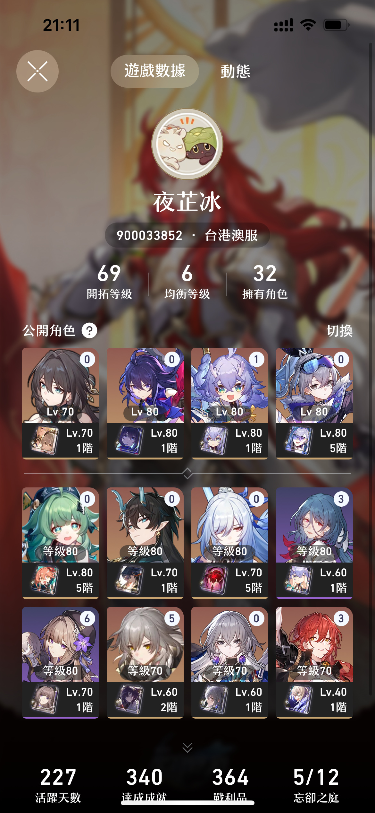
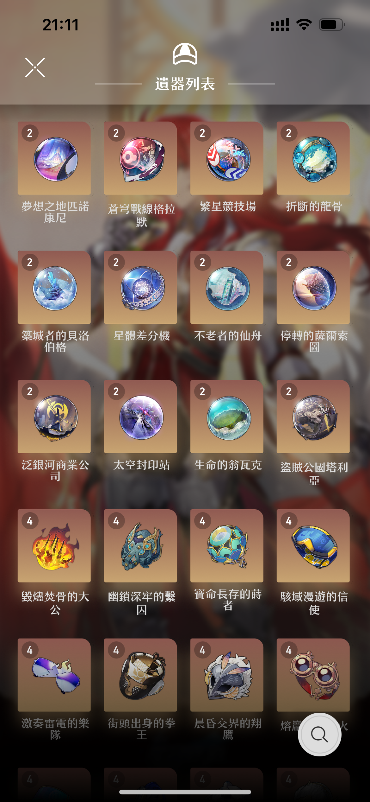
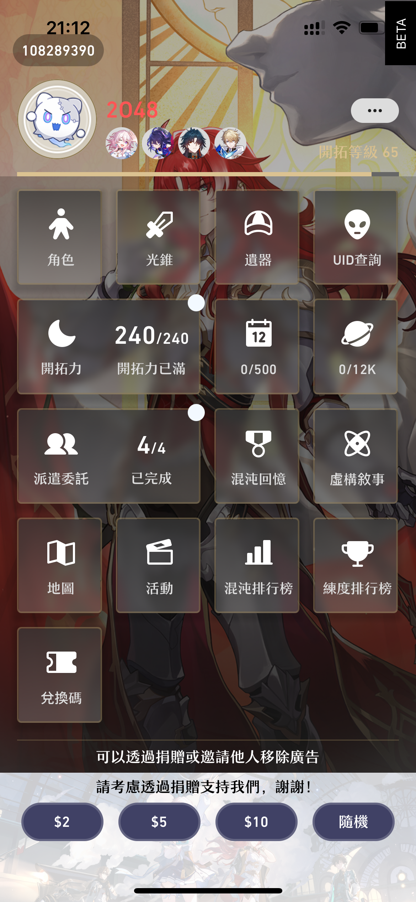
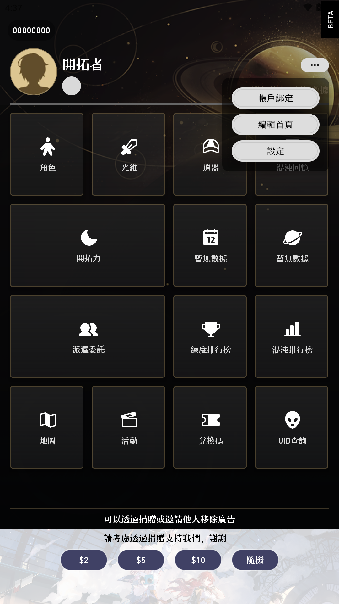
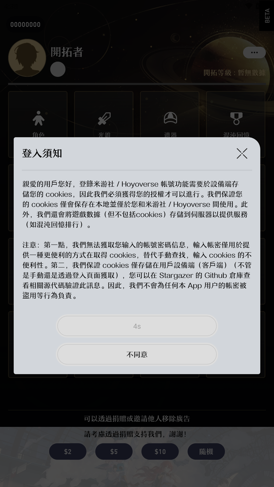
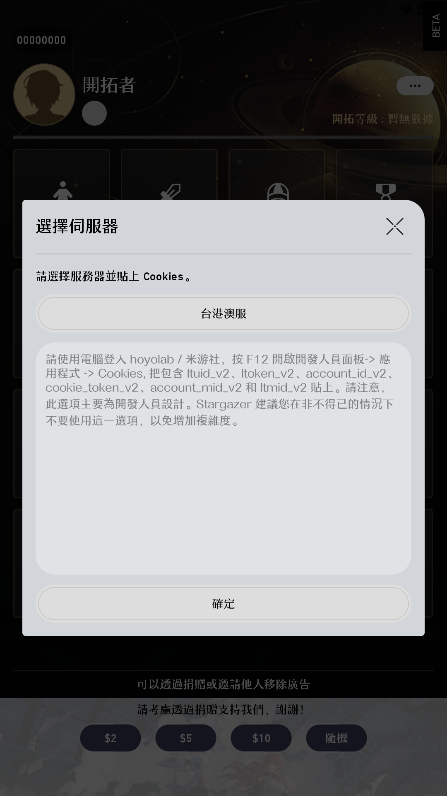
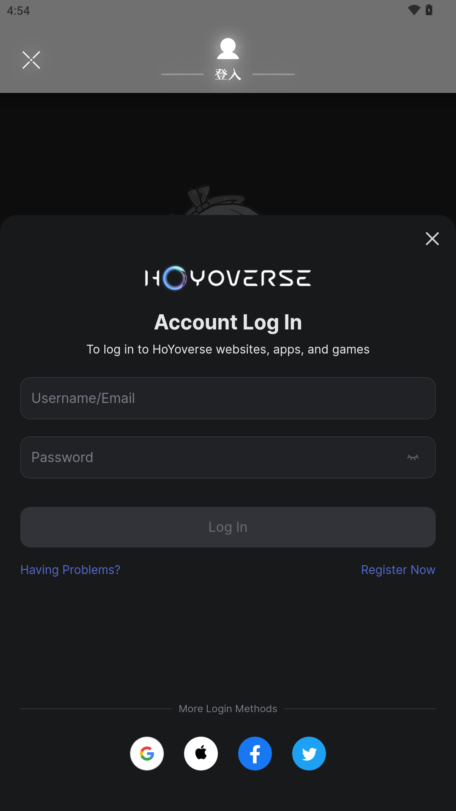
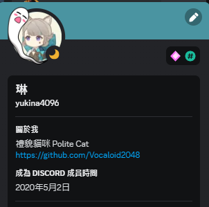

# 星穹觀星者 2

> 繼承自第一代的想法，把第一代未能完成的目標寄託於此的結晶，希望能夠延續星穹觀星者的初憧 - 「讓大家能夠在工具輔助下，節省不少找資料的時間，以及提供一些更貼地的功能，豐富開拓者的體驗~」

星穹觀星者 2 是由團隊[Coding Band](https://github.com/Coding-Band)開發
- [2O48](https://github.com/2O48) : UI/UX 設計
- [夜芷冰](https://github.com/Vocaloid2048) : Team Leader 兼代碼編寫
- 【已謝幕】 [Dalufishe](https://github.com/Dalufishe) : 主要代碼編寫 (現已分道揚鑣)

### 十分感謝參加了封測的各位，在封測期間向我們提出不同寶貴建議

### 同時亦感謝明治大大的幫助和建議，為我們提供各種高階功能的指點，以及嘗試整合[這篇文章](https://forum.gamer.com.tw/C.php?bsn=72822&snA=4272)内的功能，確定不看看？

#### [按我去看 App 特點](#app-特點)

#### [按我去看 用戶資料使用聲明](#cookies-使用原則説明)

## App 簡介

星穹觀星者 2 是由團隊Coding Band開發，於 Google Play Store 和 App Store 上架，讓使用 Android 和 iOS 的開拓者都能夠體驗星穹觀星者 2。

⚠️ 請認准包裝名!!! 不要下載非以下渠道分發的版本!!!⚠️

- `com.voc.honkai_stargazer_gp` ([Google Play](https://play.google.com/store/apps/details?id=com.voc.honkai_stargazer_gp))
- `com.voc.honkaistargazer` (App Store)

 

  

📢 如果不介意的話，可以透過 App 内捐款支持我們~ 營運和 App Store 上架都是蠻燒錢的 QQ📢 
📧 如果你想與我們合作，歡迎透過加入 [Coding Band - Discord 官方伺服器](https://discord.gg/uXatcbWKv2) 聯絡我們 📧 

### Crowdin 翻譯進度

].data.translationProgress&url=https%3A%2F%2Fbadges.awesome-crowdin.com%2Fstats-15282854-638808.json>)
].data.translationProgress&url=https%3A%2F%2Fbadges.awesome-crowdin.com%2Fstats-15282854-638808.json>)
].data.translationProgress&url=https%3A%2F%2Fbadges.awesome-crowdin.com%2Fstats-15282854-638808.json>)
].data.translationProgress&url=https%3A%2F%2Fbadges.awesome-crowdin.com%2Fstats-15282854-638808.json>)
].data.translationProgress&url=https%3A%2F%2Fbadges.awesome-crowdin.com%2Fstats-15282854-638808.json>)
].data.translationProgress&url=https%3A%2F%2Fbadges.awesome-crowdin.com%2Fstats-15282854-638808.json>)
].data.translationProgress&url=https%3A%2F%2Fbadges.awesome-crowdin.com%2Fstats-15282854-638808.json>)
].data.translationProgress&url=https%3A%2F%2Fbadges.awesome-crowdin.com%2Fstats-15282854-638808.json>)
].data.translationProgress&url=https%3A%2F%2Fbadges.awesome-crowdin.com%2Fstats-15282854-638808.json>)
].data.translationProgress&url=https%3A%2F%2Fbadges.awesome-crowdin.com%2Fstats-15282854-638808.json>)
].data.translationProgress&url=https%3A%2F%2Fbadges.awesome-crowdin.com%2Fstats-15282854-638808.json>)
].data.translationProgress&url=https%3A%2F%2Fbadges.awesome-crowdin.com%2Fstats-15282854-638808.json>)
].data.translationProgress&url=https%3A%2F%2Fbadges.awesome-crowdin.com%2Fstats-15282854-638808.json>)

## App 特點

### 角色練度

#### 【不需登入】 角色、遺器評分功能

可以透過 UID 查詢 / 按下留言區任意用戶的頭像，就可以觀看該用戶的角色評分！ 
評分標準和權重仍然在測試階段，歡迎各位到[這個 Google Sheet (By 明治 和 Voc)](https://docs.google.com/spreadsheets/d/1E5FZGeIWsKABSOkjjzZ_y6DsueteM3Q-i8tgGW9Ea9c/edit?usp=sharing) 提出建議！

#### 【不需登入】 排行榜

目前 App 內提供 _練度排行榜_ 和 **混沌排行榜** 
_練度排行榜_

- 提供所有已登入用戶在該角色的角色練度排行 
- 按下該用戶名稱即可查看該用戶對應角色的練度詳細資料 

**混沌排行榜**

- 提供所有已登入用戶在指定混沌回憶的排行 
- 短按角色頭像可以切換展示等級/星魂 
- 短按關卡名稱可以切換上半/下半 
- 排行榜頂部切換混沌回憶版本 

P.S. 練度資料來自已登入用戶在遊戲内的 **支援/星海同行** 展示角色 
P.S. 混沌回憶資料來自已登入用戶  

### 社群

#### 【或需登入】 開拓者留言功能

可以在首頁按下「角色」-> 選擇角色 -> 下劃到底部

- 【不需登入】閱讀留言、查看他人分享的隊伍 (預定功能)
- 【需要登入】發送留言、點讚
- 【需要登入】發送貼圖
- 【需要登入】分享自己的隊伍 (預定功能)

P.S. 請理性使用留言功能，用戶不得洗版、任何形式的廣告、發送任何髒話、人身攻擊、辱罵、不當言論、釣魚連結、18 禁或隱喻情色類的圖文/影片/自殺自殘等字眼出現，及任何對他人構成言語/行為上的騷擾。如發現以上言論，請即紀錄證據及向伺服器 MOD 舉報。

#### 【不需登入】 UID 查詢

可以查詢所有伺服器的 UID 
請理性使用查詢功能，不應該進行枚舉動作

#### 【不需登入】 用戶角色展示櫃

可以查詢所有伺服器的 UID 
請理性使用查詢功能，不應該進行枚舉動作

#### 【不需登入】 角色、光錐、遺器資料查詢

#### 【不需登入】 星穹鐵道活動列表

#### 【不需登入】 彩蛋

### 帳戶狀態

#### 【需要登入】 即時開拓力、活躍度進度

在登入後，每次開啟 App 的時候，在主頁都會顯示帳戶即時的 :

- 開拓力和預計回滿時間
- 每日活躍度
- 派遣委託内容
- 本週模擬宇宙分數

#### 【或需登入】 混沌回憶紀錄

在登入後，按下「混沌回憶」後將會展示當期怪物内容 
按下選單旁邊按鈕展示當期 BUFF 詳情 
按下右上角的按鈕展示當前帳戶的混沌回憶紀錄（需要登入） 

### 計劃功能

#### 以下功能仍在初步計劃階段 (請幫幫我們！)

- 排軸工具
- 角色傷害模擬
- 朋友功能
- 更多彩蛋
- 更多...

### 螢幕截圖

| 角色&遺器評分                                                 | 練度排行榜                                                       | 混沌排行榜                                                     |
| ------------------------------------------------------------- | ---------------------------------------------------------------- | -------------------------------------------------------------- |
|  |  |  |

| 留言功能                                               | 查詢 UID                                                  | 用戶角色展示櫃                                                |
| ------------------------------------------------------ | --------------------------------------------------------- | ------------------------------------------------------------- |
|  |  |  |

| 角色資料查詢                                                 | 光錐資料查詢                                                      | 遺器資料查詢                                                  |
| ------------------------------------------------------------ | ----------------------------------------------------------------- | ------------------------------------------------------------- |
|  |  |  |

| 活動列表                                                  | 即時帳戶狀態                                            | 混沌回憶紀錄                                                  |
| --------------------------------------------------------- | ------------------------------------------------------- | ------------------------------------------------------------- |
|  |  |  |

---

## Cookies 使用原則説明

### 聲明

星穹觀星者 2 <b>不會</b> 收集用戶的 Cookies，用戶所有的 Cookies 均只會儲存於本地。Cookies 並不能代替帳戶密碼，無法用於第三方登入。我們不會、亦無法收集和存取用戶的帳戶和密碼。 
當用戶在按下`帳戶綁定`後，即確認知悉 App 的 Cookies 使用原則，並允許 星穹觀星者 2 獲取已登入帳戶相關數據。

### 怎樣設定即時開拓力、回憶紀錄功能？

| 首先，請到首頁按下 `...`，再按下選單内的`帳戶綁定`  | 之後請同意登入須知                                  | 同意後便會看到以下頁面                              |
| --------------------------------------------------- | --------------------------------------------------- | --------------------------------------------------- |
|  |  |  |

| ⚠️ 方法一：手動輸入 Cookies ⚠️                                                   | 🧙 方法二：到官方網頁登入 🧙                                                      |
| -------------------------------------------------------------------------------- | --------------------------------------------------------------------------------- |
| 按下`手動設定`，透過按下按鈕選取對應的伺服器，依照指引貼上 Cookies，再按「確定」 | 選取對應的伺服器 ⚠️ 選錯會找不到遊戲帳戶的！⚠️ |
|                          |                              |
|                                                                                  | 登入成功後按下 **左上方的叉號按鈕**                                               |
|                                                                                  |                              |

**大功告成!！**

## 後端伺服器説明

### 聲明

我們僅會收集並儲存以下數據，用於（日後）向用戶提供進階功能:

- 遊戲 UID、等級、名稱、伺服器、活躍日數、寶箱數、頭像
- 擁有角色，已裝備光錐，遺器名稱、等級
- 混沌回憶數據
- UID 搜尋紀錄 (僅本地儲存，我們不會收集和用來分析)
- 用戶在開拓者留言功能内的留言時間、内容

我們保留一切更改收集範圍的權利。

## 幫幫我，開拓者

我們目前在招募志願者協助我們提升 App 的質量:

### 翻譯 （把 App 的文字變成你的朋友都能看懂）

- 語言不限
- 人數不限
- 使用 Crowdin 翻譯協作平台

### Beta 測試員 （在功能推出前先幫忙找 Bug）

- 人數：100 人 (Android 和 iOS)
- 需要遵守<守則>
- 違犯規則者將被永久停止測試資格
- 請私信@yukina4096 提出申請，並提供以下資料 :
  - 使用的平台(Android / iOS)
  - 接收封測的電郵 (iOS 的話請記得提供者 Apple ID 的電郵哦)
  - 星穹 UID （方便我們紀錄錯誤之類，還請測試時用那個 UID 的帳戶登錄）
    

### <守則>

- 不得公開、私下分發 BETA 版本予任何人
- 不得拆包、捉包、反編譯 、重新打包 App
- BETA 版本並不代表正式版，務必注意
- 不得惡意攻擊伺服器/使伺服器無法正常提供服務

### 關於 Coding Band

Coding Band 由 3 位核心成員組成,分別是 : 

- 《設計大佬》[2O48](https://github.com/2O48)
- 《禮貌貓咪》[夜芷冰](https://github.com/Vocaloid2048)
- 《Furina》[Somebody](https://github.com/ilikecatgirls)
  

感謝以下曾經貢獻的各位：
- [Dalufish](https://github.com/Dalufishe)
- [NightFire19](https://github.com/NightFire19)
- [SipTik](https://github.com/SipT1k)
