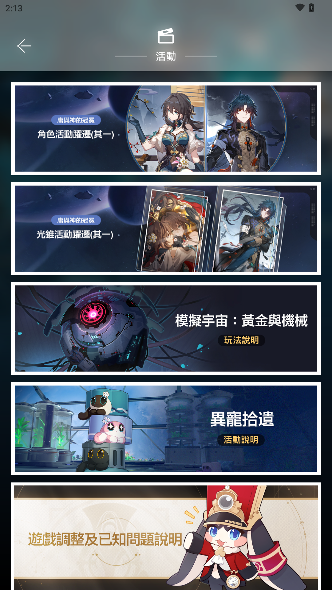
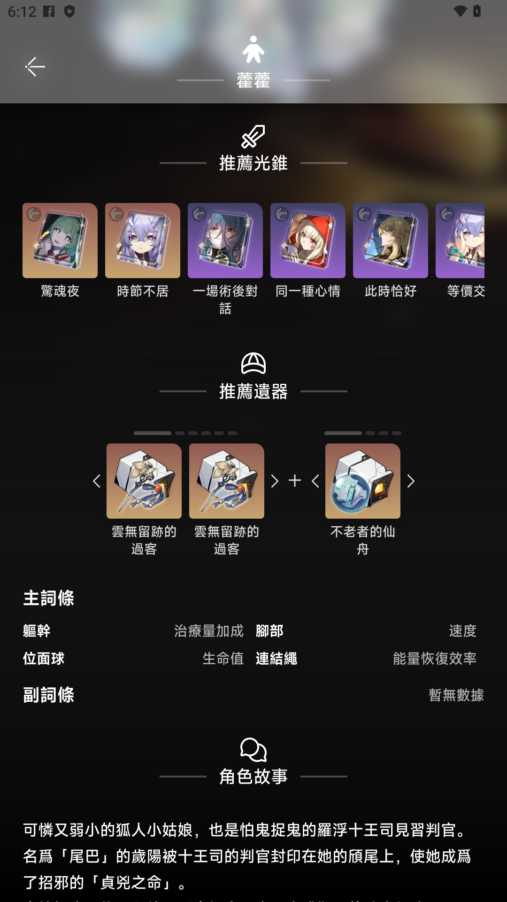

# 星穹觀星者 2

> 繼承自第一代的想法，把第一代未能完成的目標寄託於此的結晶，希望能夠延續星穹觀星者的初憧 - 「讓大家能夠在工具輔助下，節省不少找資料的時間，以及提供一些更貼地的功能，豐富開拓者的體驗~」

#### [按我去看 App 特點](#app-特點)

#### [按我去看 用戶資料使用聲明](#用戶資料使用聲明)

### 關於 App

星穹觀星者 2 是由團隊[Coding Band](https://github.com/Coding-Band)開發

- [Dalufishe](https://github.com/Dalufishe) : 主要代碼編寫
- [2O48](https://github.com/2O48) : UI/UX 設計
- [夜芷冰](https://github.com/Vocaloid2048) : Team Leader

 將在 Google Play Store 和 App Store 上架，讓使用 Android 和 iOS 的開拓者都能夠體驗星穹觀星者 2。

⚠️ 請認准包裝名!!! 不要下載非以下渠道分發的版本!!!⚠️

- `com.voc.honkai_stargazer_gp` (Google Play)
- `com.voc.honkaistargazer` (App Store)

📢 如果不介意的話，可以透過 App 内捐款支持我們~ 營運和 App Store 上架都是蠻燒錢的 QQ📢 
📧 如果你想與我們合作，歡迎透過以下方式聯絡我們 📧 

-  
- [Email](mailto:xectorda@gmail.com) (標題記得標注`合作`或者相近詞)

### Crowdin 翻譯進度

].data.translationProgress&url=https%3A%2F%2Fbadges.awesome-crowdin.com%2Fstats-15282854-638808.json>)
].data.translationProgress&url=https%3A%2F%2Fbadges.awesome-crowdin.com%2Fstats-15282854-638808.json>)
].data.translationProgress&url=https%3A%2F%2Fbadges.awesome-crowdin.com%2Fstats-15282854-638808.json>)
].data.translationProgress&url=https%3A%2F%2Fbadges.awesome-crowdin.com%2Fstats-15282854-638808.json>)
].data.translationProgress&url=https%3A%2F%2Fbadges.awesome-crowdin.com%2Fstats-15282854-638808.json>)
].data.translationProgress&url=https%3A%2F%2Fbadges.awesome-crowdin.com%2Fstats-15282854-638808.json>)
].data.translationProgress&url=https%3A%2F%2Fbadges.awesome-crowdin.com%2Fstats-15282854-638808.json>)
].data.translationProgress&url=https%3A%2F%2Fbadges.awesome-crowdin.com%2Fstats-15282854-638808.json>)
].data.translationProgress&url=https%3A%2F%2Fbadges.awesome-crowdin.com%2Fstats-15282854-638808.json>)
].data.translationProgress&url=https%3A%2F%2Fbadges.awesome-crowdin.com%2Fstats-15282854-638808.json>)

---

### 封測人員招募 (直至 2024/01/10 08:00 UTC+8)

我們正招募 20 ~ 30 位封測人員，協助我們測試 App 功能的穩定性和使用體驗，不論你是 Android 用戶，或者 iOS 用戶，都可以申請參與哦~
  
封測期為 : 2024/01/10 09:00 UTC+8 ~ 2024/01/17 09:00 UTC+8 
封測人員將會被邀請進入 Discord 伺服器，並給予臨時身份組 
**如果你沒有 Discord 帳戶，請記得申請前先註冊一個**

你可以透過這個 Email (xectorda@gmail.com) 
或者在 Discord 好友搜尋 `yukina4096`  

標明你想參加這次的封測的裝置是 Android / iOS，並加入我們的 Discord 伺服器
 
我們會在額滿後停止接受申請~

### <守則>

- 不得公開、私下分發封測版本予任何人
- 不得拆包、捉包、反編譯 、重新打包 App
- 封測版本並不代表正式版，務必注意
- 不建議分享封測内容，以免造成誤會
- 不得惡意攻擊伺服器/使伺服器無法正常提供服務

---

## 幫幫我，開拓者!

我們目前在招募志願者協助我們提升 App 的質量:

### 翻譯 （把 App 的文字變成你的朋友都能看懂）

- 語言不限（英、繁、簡、廣東話已經有了，注音我是不反對誒）
- 人數不限，但必須負責任
- 使用 Crowdin 翻譯協作平台

### Beta 測試員

- 人數：100 人 (Android 和 iOS)
- 需要遵守<守則>

### <守則>

- 不得公開、私下分發封測版本予任何人
- 不得拆包、捉包、反編譯 、重新打包 App
- 封測版本並不代表正式版，務必注意
- 不建議分享封測内容，以免造成誤會
- 不得惡意攻擊伺服器/使伺服器無法正常提供服務

## 用戶資料使用聲明

### Cookies 使用原則説明

- 星穹觀星者 2 不會 收集用戶的 Cookies，用戶所有的 Cookies 均只會儲存於本地。Cookies 並不能代替帳戶密碼，無法用於第三方登入。 
- 我們不會、亦無法收集和存取用戶的**帳戶和密碼**。 
- 當用戶在按下`帳戶綁定`後，即確認知悉 App 的 Cookies 使用原則，並允許 星穹觀星者 2 獲取已登入帳戶相關數據。

### 用戶資料收集聲明

我們僅會收集並儲存以下數據，用於（日後）向用戶提供進階功能:

- 遊戲 UID、等級、名稱、伺服器、活躍日數、寶箱數、頭像
- 擁有角色，已裝備光錐，遺器名稱、等級
- 混沌回憶數據
- 用戶在開拓者留言功能内的留言時間、内容

我們保留一切更改收集範圍的權利。 
以上資訊用於建立和管理帳戶，以及提供進階功能服務。

## App 特點

Coding Band 由 4 位核心成員組成,分別是 : 

- 《設計大佬》[2O48](https://github.com/2O48)
- 《RN 打嚕魚》[Dalufishe](https://github.com/Dalufishe)
- 《SG1 作者》[夜芷冰](https://github.com/Vocaloid2048)
- 《Furina》[Somebody](https://github.com/ilikecatgirls)
  

星穹觀星者 2 將會提供以下功能:

- 角色、光錐、遺器資料查詢
- 角色高清圖(不要問我為啥 AKA 寫真圖) (為了拍圖 差點把電腦顯卡燒了 QQ)
- 星穹鐵道活動列表
- 兌換碼
- 展示自己帳戶的即時開拓力、每日任務進度、派遣委託
- 查看自己的混沌回憶紀錄
- 展示活動列表、地圖、兌換碼功能。
- 角色推薦配隊、光錐、遺器。
- 開拓者留言功能
- 文檔支援 12 種語言，App 介面暫時支援繁簡中和廣東話 (Vocchinese)
- 背景更換 (🙂?)
- 彩蛋 (找找看吧~)

## 設備建議

|              | 最少值              | 建議值                 |
| ------------ | ------------------- | ---------------------- |
| Android 版本 | 8.0 (API 26) 或以上 | 10.0 (API 29) or above |
| iOS 版本     | 13.0 或以上         | 15.0 或以上            |
| RAM          | 2GB                 | 4GB 或以上             |
| 存儲空間     | 250MB               | 1GB 或以上             |
| App 版本號   | 誒...你知道的       | 當然是最新穩定版       |
