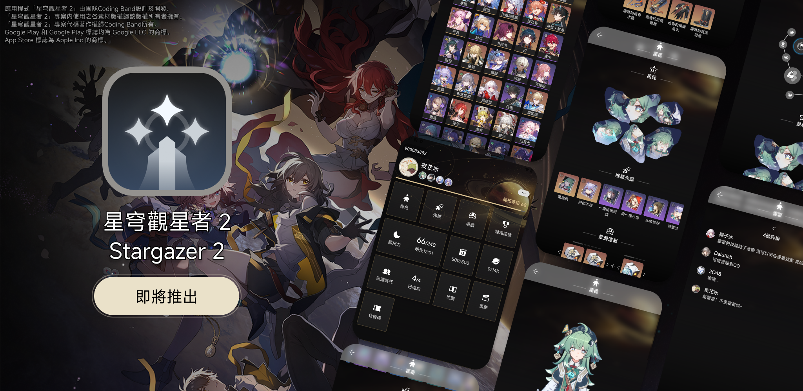
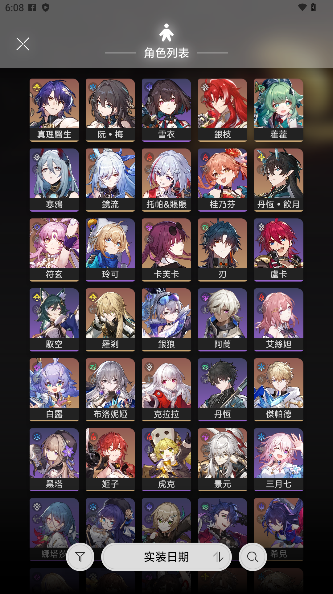
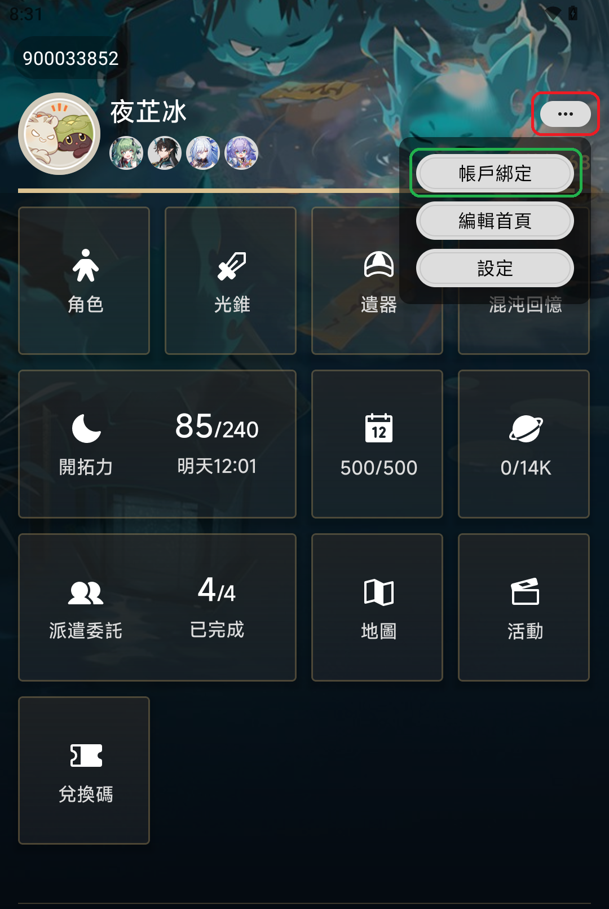

# 【密技】『這可能是市面上品質最好，功能最全的崩鐵助手』

## 你可能會想問這些問題：

- 「確定嗎？我看你的功能跟隔壁的某某小座守差不多誒」
- 「啥是星穹觀星者 2？能吃嗎？啊星穹觀星者 1 去哪了？」
- 「有支援 iOS 和 Android 嗎？翻譯呢？」
- 「我想嘗新要咋辦？在線等。」
- 「呢個 App 有冇 Support 廣東話㗎？」

### 如果你有以上疑問，看這篇文章就對了！

## App 簡介

星穹觀星者 2 是由團隊Coding Band開發
 &emsp;**(Dalufishe : 主要代碼編寫, 2O48 : UI/UX 設計, 夜芷冰 : Team Leader)**  將在 Google Play Store 和 App Store 上架，讓使用 Android 和 iOS 的開拓者都能夠體驗星穹觀星者 2。

⚠️ 請認准包裝名!!! 不要下載非以下渠道分發的版本!!!⚠️

- `com.voc.honkai_stargazer_gp` (Google Play)
- `com.voc.honkaistargazer` (App Store)

📢 如果不介意的話，可以透過 App 内捐款支持我們~ 營運和 App Store 上架都是蠻燒錢的 QQ📢 
📧 如果你想與我們合作，歡迎透過以下方式聯絡我們 📧 

- [Coding Band - Discord 官方伺服器](https://discord.gg/uXatcbWKv2) 
- [Email](mailto:xectorda@gmail.com) (標題記得標注`合作`或者相近詞)

---

### 封測人員招募 (直至 2024/01/10 08:00 UTC+8)

我們正招募 20 ~ 30 位封測人員，協助我們測試 App 功能的穩定性和使用體驗，不論你是 Android 用戶，或者 iOS 用戶，都可以申請參與哦~
  
封測期為 : 2024/01/10 09:00 UTC+8 ~ 2024/01/17 09:00 UTC+8 
封測人員將會被邀請進入 Discord 伺服器，並給予臨時身份組 
**如果你沒有 Discord 帳戶，請記得申請前先註冊一個**

你可以透過這個 Email (xectorda@gmail.com) 
或者在 Discord 好友搜尋 `yukina4096`  

標明你想參加這次的封測的裝置是 Android / iOS，並加入我們的 Discord 伺服器
 
我們會在額滿後停止接受申請~

### <守則>

- 不得公開、私下分發封測版本予任何人
- 不得拆包、捉包、反編譯 、重新打包 App
- 封測版本並不代表正式版，務必注意
- 不建議分享封測内容，以免造成誤會
- 不得惡意攻擊伺服器/使伺服器無法正常提供服務

---

## App 特點

星穹觀星者 2 將會提供以下功能:

- 角色、光錐、遺器資料查詢
- 角色高清圖(不要問我為啥 AKA 寫真圖) (為了拍圖 差點把電腦顯卡燒了 QQ)
- 星穹鐵道活動列表
- 兌換碼
- 展示自己帳戶的即時開拓力、每日任務進度、派遣委託
- 查看自己的混沌回憶紀錄
- 展示活動列表、地圖、兌換碼功能。
- 角色推薦配隊、光錐、遺器。
- 開拓者留言功能
- 文檔支援 12 種語言，App 介面暫時支援繁簡中和廣東話 (Vocchinese)
- 背景更換 (🙂?)
- 彩蛋 (找找看吧~)

---

_(Coding Band #develop 頻道内)_ 
Dalufishe : 「由超級無敵宇宙程式設計軟體開發前後端 app 開發大佬大神｛DALUFISH｝開發」

夜芷冰 : 「😑 還是算了吧，又在講廢話。」

2O48 : 「这个图标没置中，@Dalufishe 改一下」

_(設計對白)_

---

## Cookies 使用原則説明

### 聲明

星穹觀星者 2 <b>不會</b> 收集用戶的 Cookies，用戶所有的 Cookies 均只會儲存於本地。Cookies 並不能代替帳戶密碼，無法用於第三方登入。我們不會、亦無法收集和存取用戶的帳戶和密碼。 
當用戶在按下`帳戶綁定`後，即確認知悉 App 的 Cookies 使用原則，並允許 星穹觀星者 2 獲取已登入帳戶相關數據。

### 怎樣設定即時開拓力、回憶紀錄功能？

首先，請到首頁按下 `...`，再按下選單内的`帳戶綁定`

然後選取對應的伺服器 ⚠️ 選錯會找不到遊戲帳戶的！⚠️

再來就是輸入帳密 ⚠️ 暫時只支援 Hoyoverse 通行證 / 米遊社 ⚠️

登入成功後按下 **左上方的叉號按鈕** 
**大功告成!！**

## 後端伺服器説明

### 聲明

我們僅會收集並儲存以下數據，用於（日後）向用戶提供進階功能:

- 遊戲 UID、等級、名稱、伺服器、活躍日數、寶箱數、頭像
- 擁有角色，已裝備光錐，遺器名稱、等級
- 混沌回憶數據
- 用戶在開拓者留言功能内的留言時間、内容

我們保留一切更改收集範圍的權利。

## 幫幫我，開拓者!

我們目前在招募志願者協助我們提升 App 的質量:

### 翻譯 （把 App 的文字變成你的朋友都能看懂）

- 語言不限（英、繁、簡、廣東話已經有了，注音我是不反對誒）
- 人數不限，但必須負責任
- 使用 Crowdin 翻譯協作平台

### 封測測試 (在別人試到之前就試誒)

- 人數：20 人 (Android 和 iOS)
- 需要遵守<守則>

### Beta 測試員

- 人數：100 人 (Android 和 iOS)
- 需要遵守<守則>

### <守則>

- 不得公開、私下分發封測版本予任何人
- 不得拆包、捉包、反編譯 、重新打包 App
- 封測版本並不代表正式版，務必注意
- 不建議分享封測内容，以免造成誤會
- 不得惡意攻擊伺服器/使伺服器無法正常提供服務

## 後話

### 關於星穹觀星者

星穹觀星者 2 的前身是 _星穹觀星者_，在重製的決定敲下時，我們亦把對一代未能完成的目標和祈望，寄託在星穹觀星者 2，透過改進第一代星穹觀星者的功能和介面，能夠為各位開拓者提供進階實用功能和更優的使用體驗。 
故此，星穹觀星者 2 使用了跨平台開發方案 (React Native)，讓一代沒法使用 App 的 iOS 用戶也能夠使用。兼且引入後端服務，希望能彌補第一代在功能完整性的缺失。

### 關於 Coding Band

Coding Band 由 4 位核心成員組成,分別是 : 

- 《設計大佬》2O48
- 《RN 打嚕魚》Dalufishe
- 《？？？》夜芷冰
- 《Furina》Somebody
  
