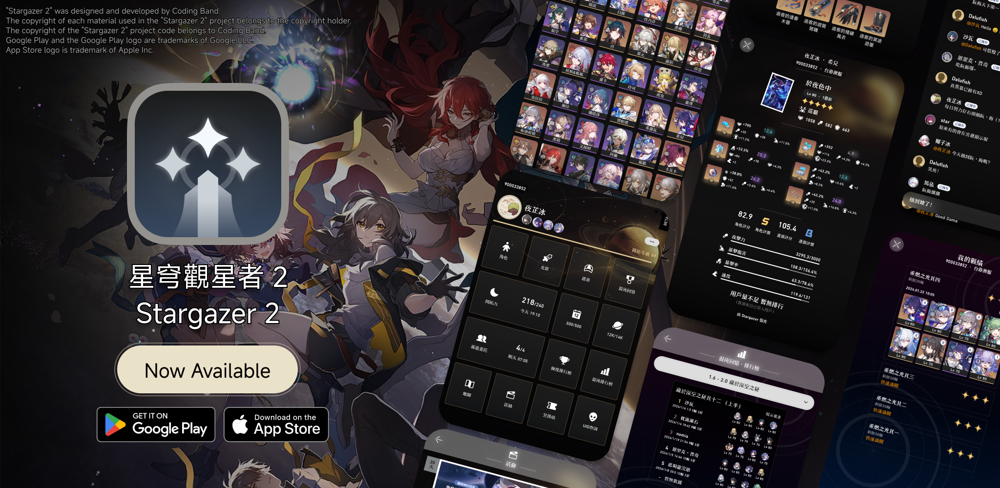
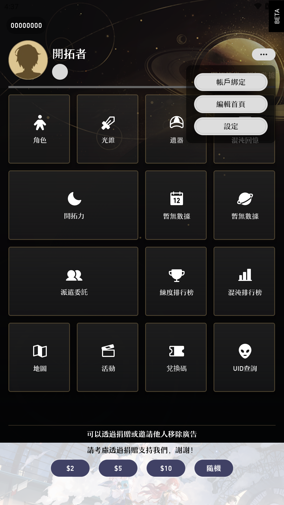
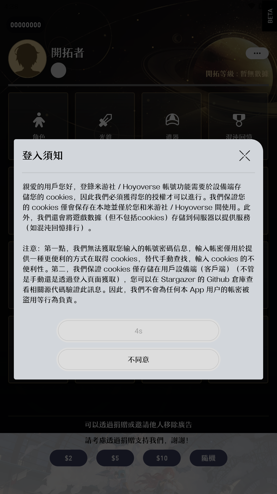
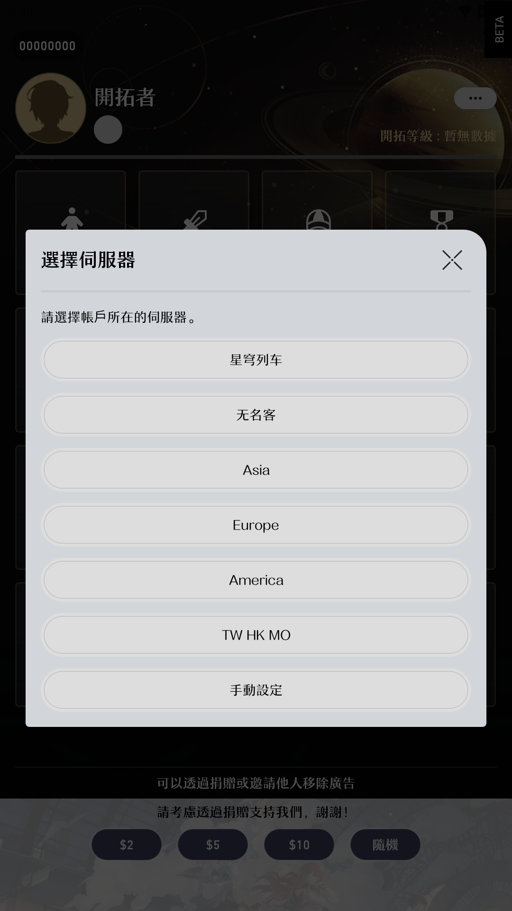
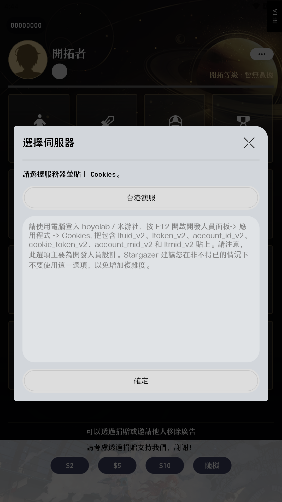
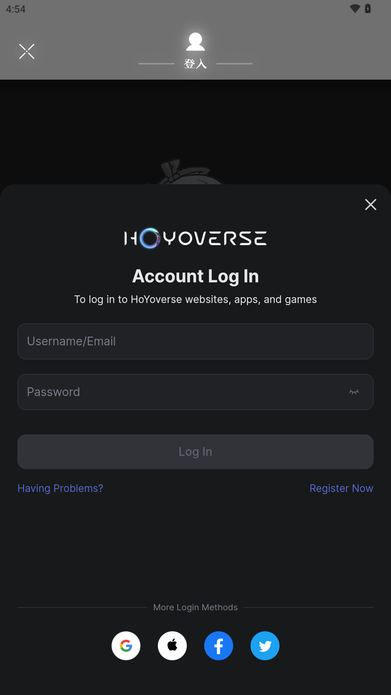
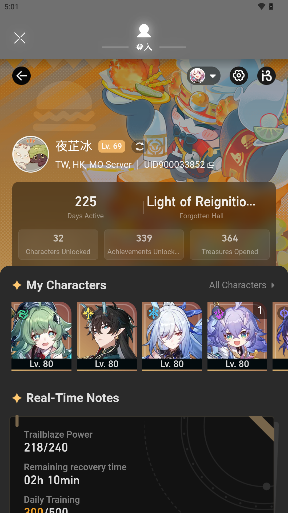
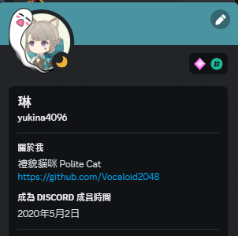
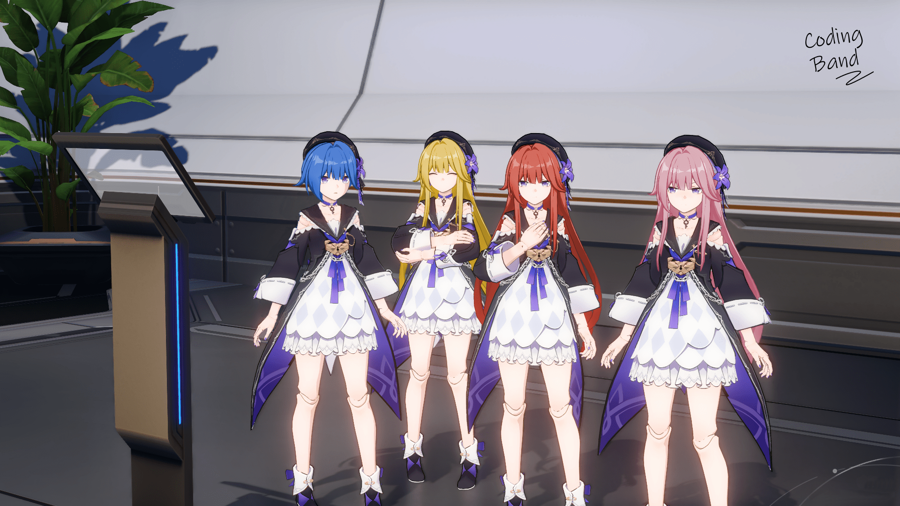

# "We have made a (probably) best-used Star Rail Assistant"

### Thank you very much to everyone who participated in the closed beta and provided us with different valuable suggestions during the closed beta.

### At the same time, we would also like to thank Meiji for his great help and suggestions, providing us with guidance on various high-end functions, and trying to integrate [this article](https://forum.gamer.com.tw/C.php?bsn=72822&snA=4272)?

## Intro

Stargazer 2 was developed byCoding Band, and will upload to Google Play and App Store, which hope trabilizer can try our app in both Android and iOS devices

⚠️ Please be careful on package name!!! Do not download versions that are not distributed through the following channels!!!⚠️

- `com.voc.honkai_stargazer_gp` ([Google Play](https://play.google.com/store/apps/details?id=com.voc.honkai_stargazer_gp))
- `com.voc.honkaistargazer` (App Store)

📧 If you want to cooperate with us, please contact us via joining our [Coding Band - Offical Server in Discord](https://discord.gg/uXatcbWKv2) 📧 

## Highlights

### Character Proficiency

#### [No need to login] Character, Relic Score ranking

You can query by UID / click on the avatar of any user in the message area to view the user's role rating! 
P.S. The scoring criteria and weights are still in testing.

#### [No need to login] Leaderboard

Currently, Stargazer 2 provides _Proficiency Leaderboard_, **MOC Leaderboard** and `Pure Fiction Leaderboard` 
_Proficiency Leaderboard_

- Provides the character proficiency ranking of all logged-in users in this character 
- Press the user name to view the detailed proficiency information of the specific character from this user. 

**MOC Leaderboard** and `Pure Fiction Leaderboard`

- Provides the ranking of all logged-in users in the specified MOC / Pure Fiction 
- Short press the character avatar to switch between display Character Level / Eidolon 
- Short press the level name to switch between Node 1 / Node 2 
- You may switch the MOC / Pure Fiction version at the top of leaderboard 

P.S. The proficiency data comes from in-game data of logged-in users. (Which set by user in "Support Character" and "Starfaring Companions") 
P.S. The MOC & Pure Fiction data comes from in-game data of logged-in users.  

### Community

#### [May need to login] Trabilizer Comments Function

You can use this function via select a character in character list, then scroll to the bottom

- [No need to login] Read other's comments and team builds (Plan to develop)
- [Pls login first] Send comments, giving likes
- [Pls login first] Send stickers
- [Pls login first] Share your team build (Plan to develop)

P.S. Please use the message function rationally. Users are not allowed to wash pages, post any form of advertising, send any swear words, personal attacks, insults, inappropriate remarks, phishing links, 18-year-old prohibited / NSFW or metaphorical erotic images/videos/words such as suicide and self-harm, and Any verbal/behavioral harassment of others. If you find the above comments, please capture the evidence immediately and report it to the server MOD.

#### [No need to login] UID Search

You can search UID between any server 
Please use the query function rationally and do not perform enumeration actions.

#### [No need to login] User Character Showcase

You can search UID between any server 
Please use the query function rationally and do not perform enumeration actions.

#### [No need to login] Characters, Lightcones and Relics Info Search

#### [No need to login] Star Rail Event List

#### [No need to login] Easter Eggs

### Account Status

#### [Pls login first] Instant Trabilize Power, Expedition display

When you open the app, it will show ...

- Remain Trabilize Power and time cost for fulfill
- Daily Training Activity
- Expedition Information
- Score of Simulated Universe in this week

In the main page (After u logged in)

#### [May need to login] MOC record

After logging in, pressing "Memory of Chaos" will display the current monster content 
Click the button next to the menu to display the current BUFF details 
Press the button in the upper right corner to display the Chaos Memories record of the current account (login required) 

#### [May need to login] Pure Fiction record

After logging in, pressing "Pure Fiction" will display the current monster content 
Press the button in the upper right corner to display the Pure Fiction record of the current account (login required) 

### Planned to Develop

#### The following features are still in the preliminary planning stages (please help us!)

- Character Combat Order Tool
- Character DMG Simulator
- Friend add/remove function
- More Easter Eggs
- More and more...

## Cookies usage policy statement

### Declaration

Stargazer 2 <b>WON'T</b> collect any cookies from user, all user cookies will only be stored locally. Cookies cannot replace account passwords and cannot be used for third-party login. We do not and cannot collect and access users' accounts and passwords. 
Once u press `Login`, which means you have confirmed that you are aware of the App's cookie usage policy allow Stargazer 2 to obtain data related to the logged in account.

### How to set up instant Trabilize Power and MOC/Pure Fiction?

| First, pls press `...` at the main page，then press `Login` | Pls agree with the policy of using this function | You will see this page after agree   |
| ----------------------------------------------------------- | ------------------------------------------------ | ------------------------------------ |
|                         |              |  |

| ⚠️ Method 1：Enter Cookies Manually ⚠️                                                                                                                             | 🧙 Method 2：Login from offical site 🧙                                                                             |
| ------------------------------------------------------------------------------------------------------------------------------------------------------------------ | ------------------------------------------------------------------------------------------------------------------- |
| Press `Manually`, select your server by pressing the button (Which wrote the server name), then follow the instruction to paste Cookies. Press "OK" for confirming | Select your server ⚠️It will be Failed to login if u selected the wrong server⚠️ |
|                                                                                                                           |                                                                               |
|                                                                                                                                                                    | After login successfully, pls press **The "X" Button at the left-top corner**                                       |
|                                                                                                                                                                    |                                                                               |

**DONE!**

## Backend server description

### Declaration

We will only collect and store the following data to provide users with advanced features (in the future):

- Game UID, level, name, server, number of active days, number of treasure chests opened, avatar
- Data of owned character, equipped with light cone, relic name and level
- MOC & Pure Fiction data
- UID search records (only stored locally, we will not collect and use them for analysis)
- The time and content of the user’s message in the message function

We reserve the right to change the scope of collection.

## Pls help me ! Trabilizers !

We are currently recruiting volunteers to help us improve the quality of our app:

### Translators 

- Any language are welcome!
- No limit to the number of translators
- Using Crowdin for doing translation

### Beta Testers 

- Limits: 100 ppls (Android and iOS)
- Need to comply with "RULES"
- Violators will be permanently suspended from testing
- Please DM @yukina4096 in Discprd to apply, remember provide the following information as well:
  - Platform used (Android / iOS)
  - Receive the email of the closed beta test (for iOS, please remember the email of the provider’s Apple ID)
  - Star Dome UID (to facilitate us to record errors and the like, please log in with the account with that UID when testing)
    

### "RULES"

- Do not distribute the BETA version to anyone publicly or privately
- Unpacking, capturing, decompiling, or repackaging the App is not allowed
- Pls note that BETA version does not represent the official version
- Do not maliciously attack the server / make the server unable to provide normal services / DDos

### About Coding Band

Coding Band consists of 4 core members, namely : 

- 《Designer》[2O48](https://github.com/2O48)
- 《RN Fish》[Dalufish](https://github.com/Dalufishe)
- 《Polite Cat》[Voc-夜芷冰](https://github.com/Vocaloid2048)
- 《Furina》[Somebody](https://github.com/ilikecatgirls)
  
